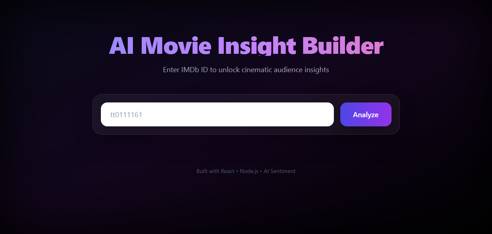
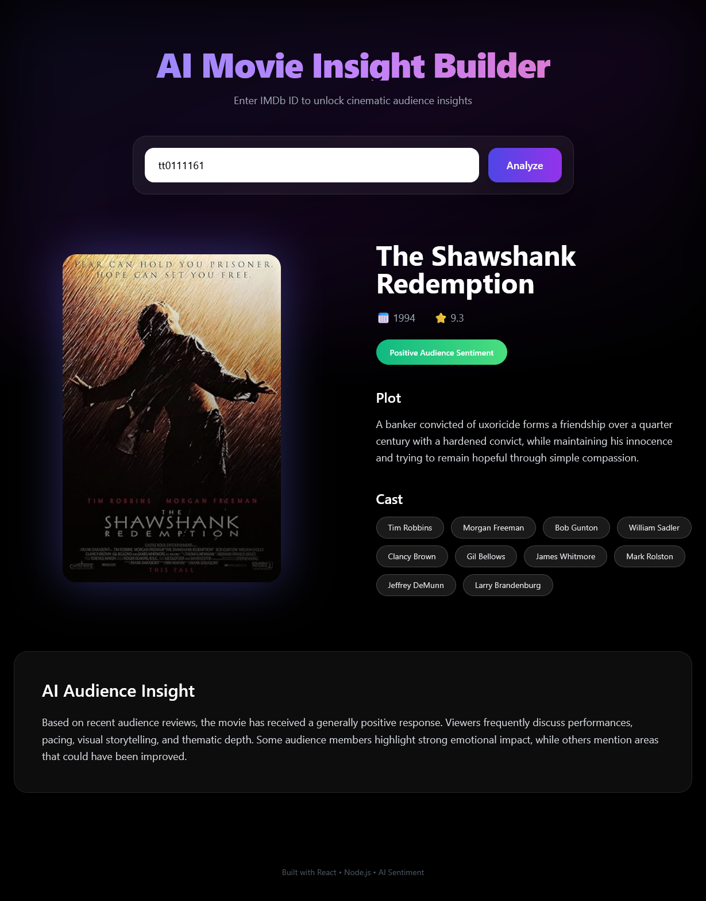

# 🎬 AI Movie Insight Builder

An AI-powered Full Stack Movie Application that allows users to search movies and get detailed insights with a clean modern UI.

---

## 📸 Application Preview

### 🏠 Home Page


### 🔍 Search & Details Page


---

## 🚀 Tech Stack

### 🎨 Frontend
- React.js
- Tailwind CSS
- Vite

### ⚙️ Backend
- Node.js
- Express.js
- REST API Architecture

---

## ✨ Features

- 🔎 Movie Search Functionality
- 🎬 Detailed Movie Information
- ⭐ IMDB Ratings Display
- 🤖 AI Generated Insights
- 📱 Fully Responsive Design
- ⚡ Fast & Optimized Performance

---

## 📂 Project Structure

```
ai-movie-insighter/
│
├── client/    → React Frontend
├── server/    → Node + Express Backend
└── assets/    → Project Screenshots
```

---

## 🌐 Deployment

Frontend:
Backend: 

---

## 👨‍💻 Author

**Chandan Kumar**  
Final Year B.Tech CSE Student  
Aspiring Full Stack Developer 🚀
